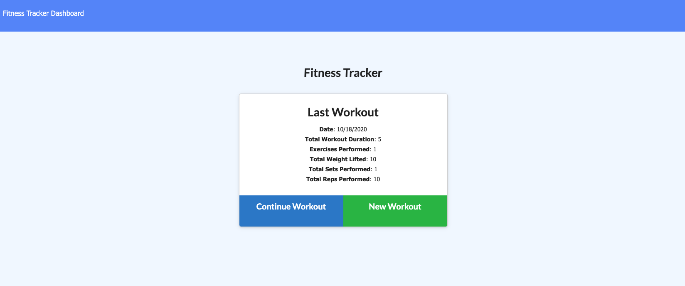

# Workout Tracker

This application is a Workout Tracker. 

When the user loads the page, users are given the option to create a new workout or continue with their last workout.

The user will be able to:

  * Add exercises to a previous workout plan.

  * Add new exercises to a new workout plan.

  * View the combined weight of multiple exercises on the `stats` page.

## User Story

* As a user, I want to be able to view create and track daily workouts. I want to be able to log multiple exercises in a workout on a given day. I should also be able to track the name, type, weight, sets, reps, and duration of exercise. If the exercise is a cardio exercise, I should be able to track my distance traveled.

## Technology
* NoSQL
* MongoDB
* Object-document mapping
* Mongoose.js
* CRUD
* Node.js

## Screenshots

## Links to Deployed Site
https://calm-bastion-11804.herokuapp.com/
